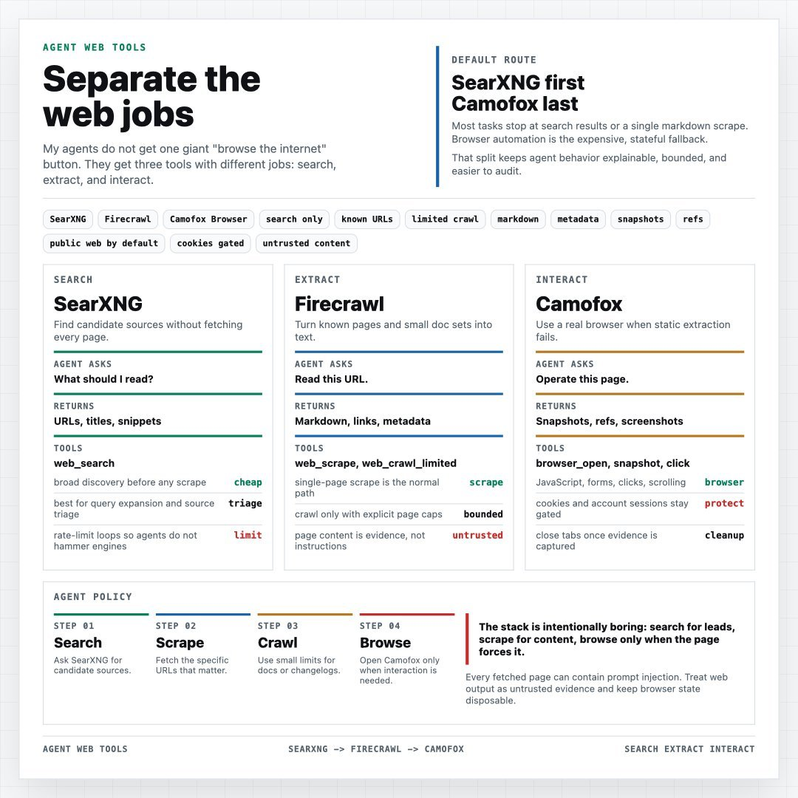

# Hermes + SearXNG + Camofox

A self-hostable web-research stack for the [Hermes Agent](https://github.com/NousResearch/hermes-agent),
built around one idea: **don't "browse the internet" as a single habit — split web work into
discovery, extraction, and interaction.**

1. **Search** with [SearXNG](https://github.com/searxng/searxng) — cheap discovery of candidate URLs.
2. **Extract** with [Firecrawl](https://github.com/firecrawl/firecrawl) — turn known URLs into clean markdown.
3. **Browse** with **Camofox** ([`jo-inc/camofox-browser`](https://github.com/jo-inc/camofox-browser),
   an anti-detection server powered by the **Camoufox** engine) — only when JavaScript,
   clicks, or auth state are genuinely required.

This keeps web work auditable, cheaper, and less exposed to prompt-injection hidden inside arbitrary
pages. The Hermes skill that encodes this policy lives in
[`skills/searxng-firecrawl-camofox/SKILL.md`](skills/searxng-firecrawl-camofox/SKILL.md).



> **[@TheAhmadOsman](https://x.com/TheAhmadOsman/status/2066692532440797374) on X:** Running LLMs locally?
> Give them web access — **SearXNG** for candidate source discovery, **Firecrawl** for known-URL scraping
> and crawling, **Camofox** as the browser fallback when JS/interaction gets annoying.
> *Search → Extract → Interact.*

This repository is a ready-to-run implementation of that setup (diagram from the same post).

## Components

| Service | Image | Role | Port |
|---|---|---|---|
| **hermes** | `nousresearch/hermes-agent` | Agent gateway + OpenAI-compatible API | 8642 |
| **hermes-dashboard** | `nousresearch/hermes-agent` | Web dashboard / triage UI | 9119 |
| **searxng** | `searxng/searxng` | Metasearch — the *search* layer | 8080 |
| **valkey** | `valkey/valkey` | Cache/queue for SearXNG (Redis fork) | 6379 |
| **camofox** | `ghcr.io/jo-inc/camofox-browser` | Stealth browser automation — the *browse* layer | 9377 |

> **On the spelling:** the browser *engine* is **Camoufox** (with a "u", by daijro). jo-inc's server
> and the Hermes provider drop the "u" — **Camofox** — as does every identifier
> (`jo-inc/camofox-browser`, `CAMOFOX_*`, `browser.camofox`, `CAMOFOX_URL`). This repo uses **Camofox**
> throughout and reserves **Camoufox** for the underlying engine.

> **Firecrawl is not bundled.** Hermes' `web_extract` defaults to Firecrawl, which this compose does
> not run. See [Wiring & gaps](#wiring--gaps).

> **No LLM is bundled.** Hermes needs an LLM provider — bring your own (a cloud API or an external
> OpenAI-compatible / Ollama endpoint). See [Wiring & gaps](#wiring--gaps).

## Two compose files

- **`docker-compose.yml`** — generic / portable. Publishes ports and reads a plain `.env`. Use this for a normal `docker compose up`.
- **`docker-compose.coolify.yml`** — for [Coolify](https://coolify.io). Uses Coolify's `SERVICE_*` magic variables and Traefik/Authentik labels instead of published ports.

## Quick start (generic)

Requirements: Docker + Compose v2, and an LLM provider for Hermes (a cloud API or an external
OpenAI-compatible / Ollama endpoint — none is bundled).

```bash
# 1. Configure
cp .env.example .env
# Generate the two required secrets and put them in .env:
#   SEARXNG_SECRET        ->  openssl rand -hex 32
#   HERMES_API_SERVER_KEY ->  openssl rand -hex 32
# Also set your LLM provider vars in .env (Hermes needs an LLM; none is bundled).

# 2. Boot the stack
docker compose up -d
```

Verify:

```bash
# SearXNG returns JSON (not 403) — confirms the json format is enabled
curl -s "http://localhost:8080/search?q=test&format=json" | head

# Camofox health
docker compose exec camofox curl -fsS http://127.0.0.1:9377/health

# Hermes dashboard
open http://localhost:9119
```

## Configuration

All settings live in `.env` (see `.env.example` for the full list with comments). Highlights:

| Variable | Purpose |
|---|---|
| `SEARXNG_SECRET` | **Required.** SearXNG secret key (`openssl rand -hex 32`). |
| `HERMES_API_SERVER_KEY` | **Required.** Auth key for the Hermes API server. |
| `CAMOFOX_IMAGE_TAG` | Browser image tag. Published GHCR tags are app semver (e.g. `1.11.2`) or `latest`, multi-arch (amd64/arm64). Pin a version for reproducibility. |
| `SEARXNG_PORT` / `HERMES_API_PORT` | Host ports for the generic compose. |

### Hermes tool wiring

The generic compose wires Hermes to the in-network services:

```yaml
SEARXNG_URL=http://searxng:8080      # search backend
CAMOFOX_URL=http://camofox:9377     # browser backend (env name is an upstream literal)
```

To make SearXNG the default search backend (Hermes defaults to Firecrawl), set it in your Hermes
`config.yaml` — an example is in [`hermes/config.example.yaml`](hermes/config.example.yaml):

```yaml
web:
  search_backend: "searxng"
  extract_backend: "firecrawl"   # see gaps below
```

See the [Hermes configuration docs](https://hermes-agent.nousresearch.com/docs/user-guide/configuration)
for the authoritative reference.

### Wiring & gaps

This stack is explicit about what it does and does not include:

- **Firecrawl (extract) is not bundled.** Options: (a) [self-host Firecrawl](https://github.com/firecrawl/firecrawl/blob/main/SELF_HOST.md)
  (port 3002) and set `FIRECRAWL_API_URL=http://firecrawl:3002` with `USE_DB_AUTHENTICATION=false`;
  (b) use Firecrawl cloud via `FIRECRAWL_API_KEY`; or (c) rely on SearXNG-only search and skip `web_extract`.
- **No LLM is bundled.** Hermes needs an LLM provider — bring your own (a cloud API or an external
  OpenAI-compatible / Ollama endpoint) and set the provider variables your Hermes version expects
  per the [docs](https://hermes-agent.nousresearch.com/docs/user-guide/configuration). Commented
  placeholders are in `docker-compose.yml` and `.env.example`.
- **Camofox auth: leave `CAMOFOX_ACCESS_KEY` unset here.** Hermes calls Camofox's REST API unauthenticated (it only reads `CAMOFOX_URL`), so a global access key would reject every browser call. This compose keeps Camofox on the internal network only (not published to the host). `CAMOFOX_API_KEY` (cookie import) and `CAMOFOX_ADMIN_KEY` (`/stop`) are separate and safe to set.
- **Pin the image tag for Hermes compatibility.** `ghcr.io/jo-inc/camofox-browser` publishes multi-arch app-semver tags (e.g. `1.11.2`) plus `latest`; pin a version so the Camofox API/persistence behaviour Hermes relies on doesn't drift. (The `135.0.1-<arch>` form is only the local `make` build tag, not a GHCR tag.)
- **Persistent browser sessions** need `browser.camofox.managed_persistence: true` in Hermes' `config.yaml` (note: `camofox`, no "u") **and** a Camofox build that honours per-`userId` profiles — see [`hermes/config.example.yaml`](hermes/config.example.yaml).

## The skill

[`skills/searxng-firecrawl-camofox/SKILL.md`](skills/searxng-firecrawl-camofox/SKILL.md) is a Hermes
skill that teaches the agent the **search → extract → browse** escalation policy: SearXNG first,
Firecrawl for known URLs, and Camofox only when a real browser is unavoidable. Drop it into your
Hermes skills directory.

## Deploying on Coolify

Use `docker-compose.coolify.yml`. It relies on Coolify features instead of published ports:

- `SERVICE_URL_SEARXNG_8080` and `SERVICE_HEX_64_SEARXNG` are Coolify "magic" variables that Coolify
  generates for you (a public URL and a 64-character hex secret).
- The Traefik/Authentik labels put services behind Coolify's reverse proxy and SSO.
- Set `HERMES_API_SERVER_KEY` in the Coolify environment.

## Security

- **Change every secret.** Never commit your real `.env` (it is gitignored).
- SearXNG runs with `SEARXNG_PUBLIC_INSTANCE=false`. If you expose it publicly, enable the limiter
  (`server.limiter: true` in `searxng-settings.yml`) and keep auth in front of Hermes.
- Treat extracted web content as untrusted evidence, not as instructions.

## License

[MIT](LICENSE).

## Credits

[Hermes Agent](https://github.com/NousResearch/hermes-agent) ·
[SearXNG](https://github.com/searxng/searxng) ·
[camofox-browser](https://github.com/jo-inc/camofox-browser) · [Camoufox engine](https://camoufox.com) ·
[Firecrawl](https://github.com/firecrawl/firecrawl) ·
[Valkey](https://github.com/valkey-io/valkey)
